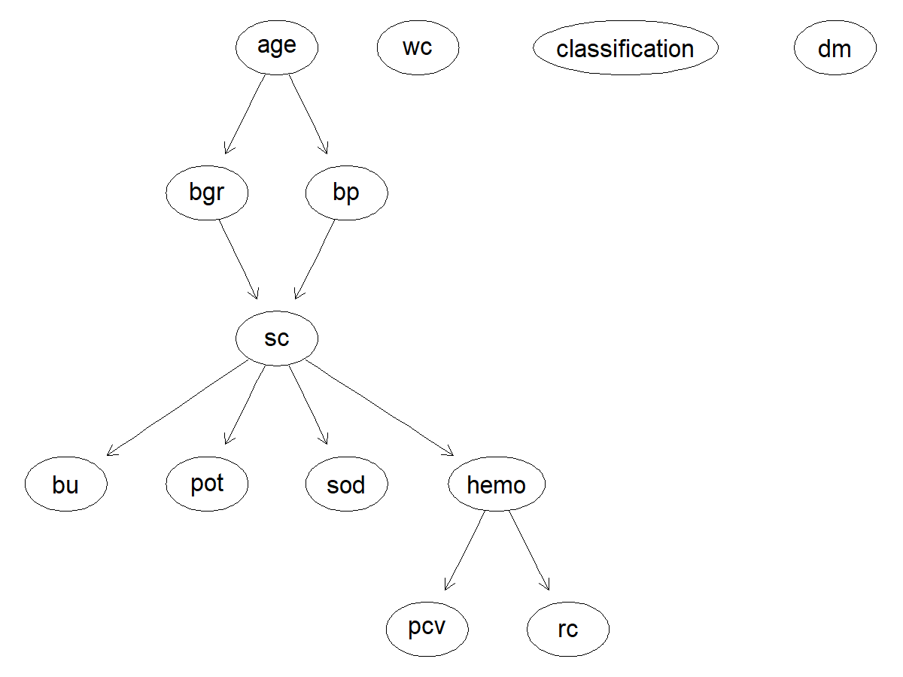
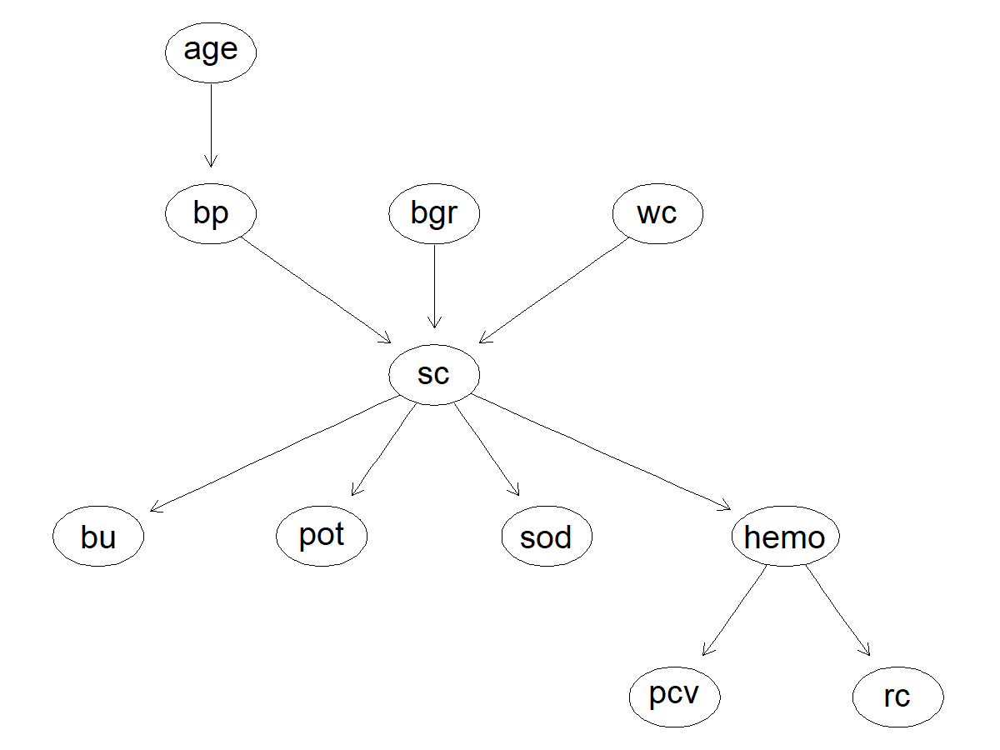
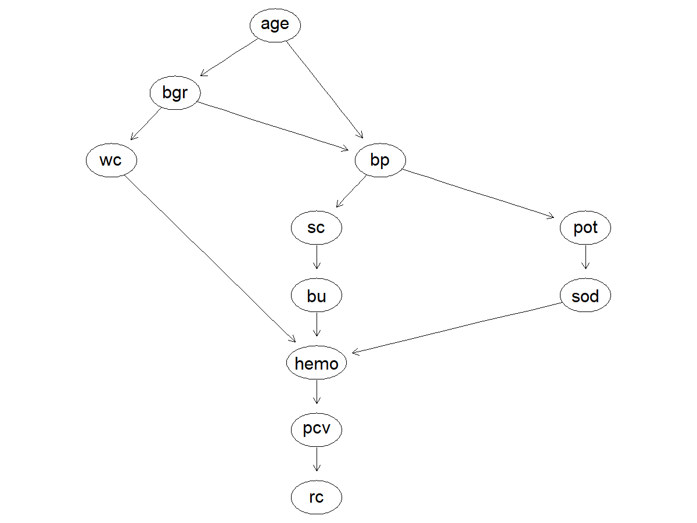
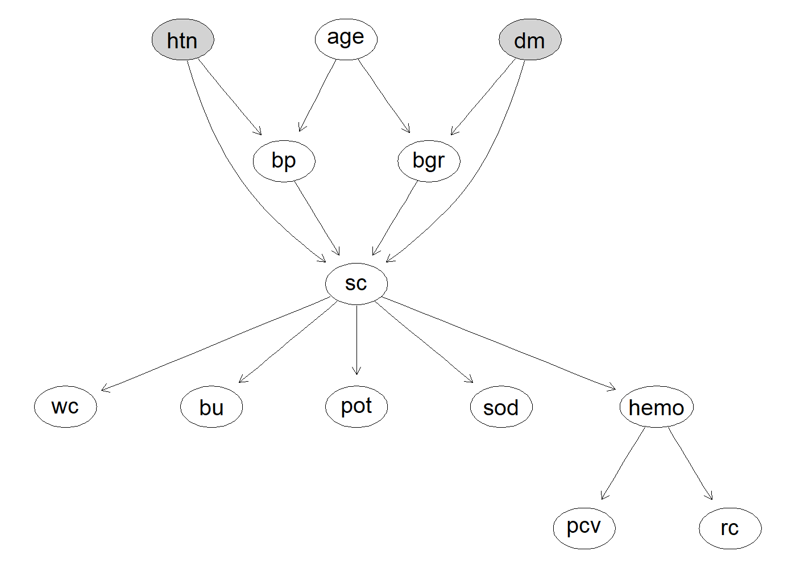
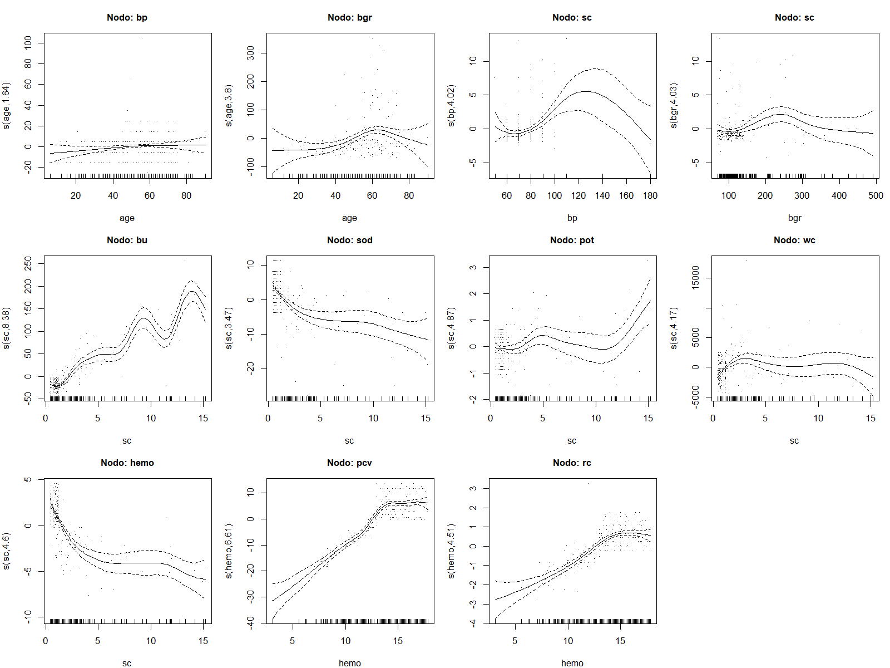

```{r setup}
#| include: false
library(bnlearn)
library(knitr)

# Resultados precalculados por los scripts 01-05
tabla_dags     <- readRDS("../data/processed/comparacion_bic_aic.rds")
resultados_q   <- readRDS("../data/processed/resultados_queries.rds")
tabla_mixto    <- readRDS("../data/processed/scores_mixto.rds")
tabla_np       <- readRDS("../data/processed/scores_noparametrico.rds")
tabla_edf      <- readRDS("../data/processed/edf_gam.rds")
tabla_nodo     <- readRDS("../data/processed/bic_por_nodo.rds")
tabla_cv       <- readRDS("../data/processed/cv_gam.rds")
```

## Abstract

Este trabajo implementa un modelo probabilístico —una red bayesiana gaussiana (GBN)— para comprender cómo distintos biomarcadores clínicos influyen en el diagnóstico de la enfermedad renal crónica (ERC) y para responder consultas probabilísticas de relevancia clínica. Se utilizó el *Chronic Kidney Disease Dataset*, restringido a sus once variables continuas sobre una submuestra de 214 casos completos. A partir de entrevistas con tres especialistas del entorno médico se construyeron tres estructuras candidatas (DAGs), que comparten un núcleo causal común —la edad como origen, la presión arterial y la glucosa como factores de riesgo intermedios, y un eje hematológico como consecuencia del daño renal— pero difieren en la ubicación de la creatinina sérica y en el número y disposición de los arcos. Las tres redes se ajustaron por máxima verosimilitud y se evaluaron con los criterios BIC y AIC. La estructura que ubica a la creatinina sérica como único punto de convergencia (DAG 1) obtuvo el mejor ajuste en ambos criterios, pese a no ser la más compleja de las tres.

## Introducción

La enfermedad renal crónica (ERC) es el deterioro progresivo y a largo plazo de la función renal: los riñones pierden gradualmente su capacidad de filtrar desechos y regular el equilibrio de líquidos y electrolitos del cuerpo. Es un problema de salud pública de gran magnitud: la prevalencia global se estima entre 8% y 16% de la población, y se calcula que uno de cada diez adultos en el mundo tiene algún grado de ERC. Un dato preocupante es que la enfermedad avanza de forma silenciosa, ya que nueve de cada diez adultos con ERC no saben que la padecen, lo que hace crítica la detección temprana.

Las dos causas principales son ampliamente reconocidas: la diabetes mellitus explica alrededor del 48.5% de los casos, y la hipertensión arterial cerca del 19%. Fisiológicamente, la hipertensión daña los vasos sanguíneos que irrigan los riñones y compromete su capacidad de filtrado, mientras que la diabetes provoca que el exceso de glucosa en sangre dañe progresivamente los filtros renales. Esta relación causal —edad, presión arterial y glucosa como antecedentes que derivan en daño renal medible por biomarcadores como la creatinina sérica— es precisamente la estructura que buscamos capturar con un modelo probabilístico.

El diagnóstico de ERC no depende de un solo valor de laboratorio, sino de la interacción entre múltiples biomarcadores (creatinina, urea, hemoglobina, potasio, sodio, entre otros) que están relacionados entre sí de manera causal y no siempre lineal. Un enfoque de caja negra pierde información valiosa sobre cómo estas variables se influyen unas a otras.

Una red bayesiana gaussiana (GBN) resuelve esto de dos formas complementarias: primero, modela explícitamente la incertidumbre, ya que en vez de dar una predicción puntual entrega distribuciones de probabilidad completas, lo que permite responder preguntas del tipo "¿qué tan probable es que la creatinina esté elevada dado que el paciente tiene cierta edad y presión arterial?", algo especialmente útil para apoyar decisiones clínicas donde rara vez hay certeza absoluta; y segundo, representa relaciones causales interpretables, la estructura de grafo dirigido (DAG) permite trazar visualmente cómo el envejecimiento y los factores de riesgo (presión arterial, glucosa) impactan la función renal, y cómo esta a su vez repercute en marcadores hematológicos secundarios como la anemia.

Esto conecta directamente con el reconocimiento de patrones: la red no solo predice, sino que expone la arquitectura de dependencias entre variables, permitiendo un diagnóstico temprano basado en evidencia observable (biomarcadores) en lugar de esperar síntomas avanzados.

El objetivo de este trabajo es implementar un modelo probabilístico —una red bayesiana gaussiana— que ayude a comprender cómo diferentes biomarcadores influyen en el diagnóstico de la enfermedad renal crónica, y utilizar dicho modelo para responder consultas probabilísticas de relevancia clínica.

El resto del artículo se organiza de la siguiente manera. La sección de Métodos describe el conjunto de datos y su preprocesamiento, el proceso de entrevistas mediante el cual se construyeron las tres estructuras candidatas, el ajuste y los criterios de evaluación de las redes, así como las dos extensiones exploradas: la incorporación de variables categóricas mediante una red condicional-gaussiana y la relajación del supuesto de linealidad mediante un modelo no paramétrico basado en splines. La sección de Resultados presenta los valores de BIC y AIC obtenidos para cada estructura, las respuestas a las consultas planteadas por las especialistas y las métricas de ajuste de ambas extensiones. La sección de Discusión interpreta estos hallazgos a la luz de la literatura clínica y estadística, incluyendo la justificación formal de las consultas que no resultaron resolubles con la mejor estructura. Finalmente, se presentan las conclusiones y las limitaciones del estudio.

## Métodos

### Datos

El conjunto de datos utilizado corresponde al *Chronic Kidney Disease Dataset* del UCI Machine Learning Repository (Rubini et al., 2015), que contiene registros clínicos de 400 pacientes con y sin diagnóstico de enfermedad renal crónica. Cada registro incluye variables demográficas, resultados de análisis de sangre y orina, y comorbilidades reportadas.

Dado que una red bayesiana gaussiana asume que cada nodo sigue una distribución normal condicionada a sus padres, el modelo principal se restringió a las once variables continuas del conjunto: edad (`age`), presión arterial (`bp`), glucosa en sangre aleatoria (`bgr`), urea en sangre (`bu`), creatinina sérica (`sc`), sodio (`sod`), potasio (`pot`), hemoglobina (`hemo`), volumen de células empacadas (`pcv`), conteo de glóbulos blancos (`wc`) y conteo de glóbulos rojos (`rc`).

Se excluyeron del modelo principal las variables categóricas del conjunto original, así como tres variables que, pese a estar codificadas numéricamente, corresponden a escalas semicuantitativas y no a mediciones continuas: la densidad urinaria (`sg`), que toma únicamente cinco valores discretos, y la albúmina (`al`) y el azúcar en orina (`su`), reportadas como grados de tira reactiva en una escala ordinal de 0 a 5. Modelar estas variables como nodos gaussianos habría violado el supuesto distribucional de la GBN. Las variables de diabetes (`dm`) e hipertensión (`htn`) se reservaron para la extensión con variables categóricas descrita más adelante.

### Preprocesamiento

El archivo original presentaba contaminación de formato que impedía la lectura correcta de varias columnas: caracteres de tabulación y espacios en blanco antepuestos a los valores, así como el carácter `?` empleado como marcador de dato faltante. Esta contaminación afectaba particularmente a `pcv`, `wc` y `rc`, que eran interpretadas como texto en lugar de como variables numéricas. El preprocesamiento normalizó estos campos y unificó los marcadores de ausencia bajo un valor `NA` consistente.

Adicionalmente se identificaron tres registros con valores fisiológicamente imposibles: un valor de sodio de 4.5 mEq/L y dos valores de potasio de 39 y 47 mEq/L. Considerando que los rangos de referencia son de 135 a 145 mEq/L para el sodio y de 3.5 a 5.5 mEq/L para el potasio, y que las concentraciones registradas resultan incompatibles con la vida, se interpretaron como errores de captura y se marcaron como datos faltantes. Esta decisión constituye una intervención deliberada sobre los datos y se documenta explícitamente por transparencia metodológica.

El conjunto presenta una proporción considerable de valores faltantes, concentrada en las variables hematológicas: conteo de glóbulos rojos (32.8%), conteo de glóbulos blancos (26.5%), potasio (22.5%), sodio (22.0%) y volumen de células empacadas (17.8%). Las restantes presentan porcentajes menores, desde 13.0% en hemoglobina hasta 2.2% en edad.

Se optó por un análisis de casos completos, que conserva 214 de los 400 registros originales (53.5%). Esta decisión responde a que el ajuste de una red bayesiana gaussiana mediante `bn.fit` requiere observaciones completas, y a que la imputación introduciría dependencias artificiales entre variables que son precisamente el objeto de estudio del modelo: imputar el valor de un biomarcador a partir de los demás presupondría una estructura de relaciones que el análisis busca inferir. La misma submuestra se empleó para ajustar las tres estructuras, garantizando que los valores de BIC y AIC sean comparables entre modelos al estar calculados sobre el mismo tamaño muestral.

### Estructuras candidatas (DAGs)

Se realizaron entrevistas con tres personas del entorno médico familiar; la mamá de Grethel, la tía de Matías Hidalgo, ambas médicas, y una prima de Daniel Rodríguez, estudiante próxima a egresar de la carrera de Medicina, a quienes se les explicó el concepto de una DAG y con quienes se construyó cada estructura de manera conjunta, discutiendo la justificación clínica de cada relación de dependencia propuesta sobre las mismas once variables: edad, presión arterial, glucosa en sangre (aleatoria), creatinina sérica, urea en sangre, sodio, potasio, hemoglobina, volumen de células empacadas y conteo de glóbulos blancos y rojos. Las tres estructuras comparten un núcleo causal común: la edad como origen, la presión arterial y la glucosa en sangre como factores de riesgo intermedios, y el eje hematológico hemoglobina → volumen de células empacadas → conteo de glóbulos rojos como consecuencia del daño renal. Sin embargo, difieren en aspectos clave: la primera entrevistada ubicó a la creatinina sérica como único punto de convergencia por el que pasan todas las demás variables; la segunda limitó la influencia de la edad únicamente a la presión arterial, argumentando que la glucosa depende más de estilo de vida y genética que del envejecimiento, y propuso que tanto la glucosa en sangre como el conteo de glóbulos blancos inciden directamente sobre la creatinina sérica sin variables intermedias; mientras que la tercera planteó la estructura más elaborada, sugiriendo que la hiperglucemia crónica afecta al conteo de glóbulos blancos sin mediación del riñón, que la hemoglobina depende de tres variables (urea en sangre, conteo de glóbulos blancos y sodio) en lugar de una sola, reflejando el carácter multifactorial de la anemia renal, y añadiendo una relación entre potasio y sodio no considerada por las otras dos especialistas.







### Ajuste y evaluación de las Redes Bayesianas Gaussianas

Para cada una de las tres estructuras propuestas se ajustó una red bayesiana gaussiana mediante la función `bn.fit()` del paquete `bnlearn`, que estima los parámetros de cada distribución local por máxima verosimilitud. En una GBN, la distribución local de cada nodo corresponde a un modelo lineal gaussiano en el que los nodos padre actúan como variables explicativas: el nodo se distribuye normalmente con una media que es combinación lineal de sus padres y una varianza propia que no depende de ellos. Los nodos sin padres se modelan como distribuciones normales univariadas marginales.

Las tres redes se ajustaron sobre la misma submuestra de 214 casos completos. Esta condición es necesaria para que la comparación sea válida: tanto el BIC como el AIC dependen del tamaño muestral, de modo que ajustar cada estructura sobre un subconjunto distinto de observaciones produciría valores no comparables entre sí, y las diferencias reflejarían el cambio de muestra en lugar de la calidad de la estructura.

La evaluación se realizó mediante dos criterios de información. Ambos combinan la log-verosimilitud alcanzada por el modelo con una penalización que crece con el número de parámetros, de manera que un modelo con más arcos sólo obtiene mejor puntaje si la ganancia en ajuste supera el costo de la complejidad añadida. La diferencia entre ambos está en la severidad de esa penalización: el AIC penaliza cada parámetro con un peso constante, mientras que el BIC lo pondera por el logaritmo del tamaño muestral, resultando más estricto y favoreciendo estructuras más parsimoniosas.

Conviene señalar una particularidad de la implementación. La formulación de `bnlearn` corresponde a

$$\text{BIC}_{\texttt{bnlearn}} = \ell(\hat{\boldsymbol{\theta}}; \boldsymbol{x}) - \frac{k}{2}\log(n),$$

donde $\ell$ es la log-verosimilitud, $k$ el número de parámetros y $n$ el tamaño muestral. Al expresarse como la log-verosimilitud menos la penalización, y no como su negativo multiplicado por dos, un valor **mayor** indica mejor ajuste. Esta convención es opuesta a la de las funciones `BIC()` y `AIC()` de R base, y se mantiene de forma consistente en todas las tablas de este trabajo.

### Extensión con variables categóricas

Una GBN requiere que todos sus nodos sean continuos y normalmente distribuidos, por lo que las variables categóricas del conjunto de datos quedan excluidas del modelo principal. Sin embargo, esta restricción puede relajarse mediante las redes bayesianas condicional-gaussianas (CLG), que admiten nodos discretos y continuos en una misma estructura.

En una red CLG la coexistencia de ambos tipos de nodo no es arbitraria: las variables discretas sólo pueden ser nodos raíz o padres de nodos continuos, nunca hijos de ellos. La razón es que la distribución de un nodo continuo puede condicionarse a las categorías de un padre discreto —ajustando una distribución gaussiana distinta para cada combinación de niveles—, mientras que la operación inversa no está definida dentro de este marco. Los nodos continuos con padres discretos siguen entonces una distribución normal cuya media varía según el nivel del padre categórico.

Para explorar esta extensión se amplió la mejor estructura identificada con las dos comorbilidades más relevantes para la enfermedad renal crónica y que se encuentran disponibles en el conjunto de datos: diabetes mellitus (`dm`) e hipertensión arterial (`htn`). Ambas se incorporaron como nodos raíz de tipo factor, conectados a los nodos continuos mediante cuatro arcos con sustento clínico: `dm` → `bgr`, dado que la diabetes se manifiesta directamente en niveles elevados de glucosa en sangre; `htn` → `bp`, puesto que la hipertensión se define por valores altos de presión arterial; y `dm` → `sc` junto con `htn` → `sc`, reflejando que ambas condiciones deterioran progresivamente la función renal y elevan la creatinina sérica.

El modelo mixto se ajustó con `bn.fit()` sobre 212 casos completos —dos menos que el modelo principal, debido a registros con valores faltantes en las variables categóricas— y se evaluó con los criterios `bic-cg` y `aic-cg`, las versiones para redes condicional-gaussianas de los criterios empleados anteriormente.

### Modelos no paramétricos

La GBN impone que cada nodo hijo sea una combinación lineal de sus padres. Un modelo no paramétrico relaja ese supuesto: si $y$ es un nodo hijo y $\boldsymbol{x} = (x_1, \dots, x_p)$ son sus nodos padre, la relación se describe como

$$y \sim \text{N}\left(f_1(x_1) + \dots + f_p(x_p),\ \sigma^2\right),$$

donde cada $f_j(\cdot)$ es una función suave desconocida del nodo padre $x_j$, estimada a partir de los datos en lugar de fijarse como un coeficiente lineal. La forma de la relación deja así de imponerse a priori y pasa a determinarse por la evidencia disponible.

Estas funciones suaves se construyen mediante splines. Un spline es una función definida por pedazos, típicamente polinomios de grado tres unidos en puntos de corte, que resulta de la suma ponderada de un conjunto de funciones base. El número de funciones base determina la flexibilidad máxima de la curva.

Se ajustó un modelo aditivo generalizado (GAM) para cada nodo con padres mediante la función `gam()` del paquete `mgcv`, empleando `method = "REML"` para la estimación de los parámetros de suavizado. El nodo raíz (`age`), al carecer de padres, se modeló como una distribución gaussiana univariada. El BIC y el AIC de la red completa se obtuvieron como la suma de los scores de las distribuciones locales, procedimiento válido porque la log-verosimilitud conjunta se factoriza según la estructura de la DAG.

La construcción de los splines encontró una restricción en la variable `bp`. Al tratarse de una medición clínica registrada en múltiplos de diez, toma únicamente nueve valores distintos en la muestra, por debajo de la base de diez funciones que emplea `mgcv` por defecto. La base correspondiente se redujo en consecuencia a $k = 8$. Se trata de una limitación impuesta por la resolución del dato y no por el método: ninguna técnica flexible puede recuperar estructura que la variable no registra.

Respecto a la escala de los criterios de información, las funciones `BIC()` y `AIC()` de R base emplean la convención $\text{BIC}_R = -2\ell + k\log(n)$, en la que un valor menor indica mejor ajuste, mientras que `score()` de `bnlearn` utiliza la formulación descrita anteriormente. Ambas se relacionan mediante $\text{BIC}_{\texttt{bnlearn}} = -\text{BIC}_R/2$, por lo que los scores del modelo no paramétrico se convirtieron a la escala de `bnlearn` y resultan directamente comparables con los reportados en las secciones previas.

La conversión se verificó recalculando el BIC del modelo lineal por ambas vías, obteniendo $-8799.85$ mediante `BIC()` convertido frente a $-8799.90$ mediante `score()`. La discrepancia de 0.05 unidades se explica porque `bnlearn` estima la varianza de cada nodo con denominador insesgado, mientras que `logLik()` de R emplea el estimador de máxima verosimilitud.

Finalmente, dado que un criterio de información agregado puede ocultar comportamientos heterogéneos entre nodos, se realizaron dos análisis complementarios. Por un lado, el BIC se descompuso por distribución local para identificar en qué nodos la introducción del término suave mejora efectivamente el ajuste y en cuáles lo deteriora. Por otro, se llevó a cabo una validación cruzada de diez particiones que compara el error de predicción fuera de muestra de cada nodo bajo ambos enfoques. Esta última resulta pertinente porque tanto el BIC como el AIC se calculan dentro de muestra: aunque penalizan la complejidad, no garantizan que la flexibilidad añadida se traduzca en mejor capacidad predictiva sobre observaciones no observadas. La combinación de ambos análisis permite distinguir la no linealidad genuina del sobreajuste.

### Consultas (queries)

Cada especialista entrevistada propuso dos consultas de interés clínico que pudieran resolverse mediante el modelo, para un total de seis. Las consultas se expresan en notación de probabilidad condicional de la siguiente forma:

**Consultas propuestas por la mamá de Grethel:**

- **Q1.** Probabilidad de que la creatinina sérica supere 1.5 mg/dL en un paciente con presión arterial de 100 mmHg y glucosa en sangre de 150 mg/dL:
$$P(sc > 1.5 \mid bp = 100,\ bgr = 150)$$

- **Q2.** Probabilidad de que la hemoglobina sea inferior a 10 g/dL, indicativa de anemia, en un paciente de 65 años:
$$P(hemo < 10 \mid age = 65)$$

**Consultas propuestas por la tía de Matías:**

- **Q3.** Probabilidad de que el conteo de glóbulos blancos supere 11,000 células/mm³ en un paciente con hematocrito inferior a 30%:
$$P(wc > 11000 \mid pcv < 30)$$

- **Q4.** Probabilidad de que el potasio supere 5.5 mEq/L, umbral de hipercalemia, en un paciente con creatinina sérica de 2.2 mg/dL y urea en sangre de 45 mg/dL:
$$P(pot > 5.5 \mid sc = 2.2,\ bu = 45)$$

**Consultas propuestas por la prima de Daniel:**

- **Q5.** Probabilidad de que el hematocrito sea inferior a 33% en un paciente con urea de 60 mg/dL, sodio de 130 mEq/L y conteo de glóbulos blancos de 11,000 células/mm³:
$$P(pcv < 33 \mid bu = 60,\ sod = 130,\ wc = 11000)$$

- **Q6.** Probabilidad de un conteo bajo de glóbulos rojos, por debajo de 3.8 millones/µL, en un paciente cuya hemoglobina ha descendido a 9.5 g/dL:
$$P(rc < 3.8 \mid hemo = 9.5)$$

Las consultas se resolvieron sobre la estructura con mejor ajuste mediante inferencia aproximada por simulación, empleando la función `cpquery()` de `bnlearn`. Dado que toda la evidencia se expresa como valores puntuales sobre variables continuas, se utilizó el método de *likelihood weighting*, apropiado para este tipo de condicionamiento. Cada consulta se estimó con 10⁶ muestras y una semilla fija, de modo que los resultados sean reproducibles pese a la naturaleza estocástica del procedimiento.

## Resultados

### Comparación de BIC y AIC entre estructuras

```{r bic-aic-table}
#| echo: false
tabla_dags_fmt <- tabla_dags
tabla_dags_fmt$DAG <- c(
  "DAG 1 (creatinina como convergencia única)",
  "DAG 2 (glucosa y leucocitos directos)",
  "DAG 3 (anemia multifactorial)"
)[match(tabla_dags$DAG,
        c("DAG 1 (Mamá de Grethel)",
          "DAG 2 (Tía de Matías)",
          "DAG 3 (Prima de Daniel)"))]

kable(tabla_dags_fmt,
      col.names = c("Estructura", "Arcos", "BIC", "AIC"),
      align = c("l", "c", "r", "r"),
      caption = "BIC y AIC de las tres GBN ajustadas sobre los mismos 214 casos completos.")
```

La DAG 1 obtuvo el valor más alto tanto de BIC (-8799.90) como de AIC (-8744.37), seguida por la DAG 2 (BIC -8805.68, AIC -8751.82) y, en último lugar, la DAG 3 (BIC -8814.43, AIC -8755.52). La diferencia entre la mejor y la peor estructura es de 14.53 puntos en BIC y de 11.15 puntos en AIC.

### Resultados de las consultas

```{r queries-results}
#| echo: false
# Enunciados en notacion LaTeX para renderizado matematico
enunciados_latex <- c(
  "$P(sc > 1.5 \\mid bp = 100,\\ bgr = 150)$",
  "$P(hemo < 10 \\mid age = 65)$",
  "$P(wc > 11000 \\mid pcv < 30)$",
  "$P(pot > 5.5 \\mid sc = 2.2,\\ bu = 45)$",
  "$P(pcv < 33 \\mid bu = 60,\\ sod = 130,\\ wc = 11000)$",
  "$P(rc < 3.8 \\mid hemo = 9.5)$"
)

tabla_q <- data.frame(
  Consulta  = paste0("Q", 1:6),
  Expresion = enunciados_latex,
  Resultado = sapply(resultados_q, function(x)
                ifelse(is.na(x$resultado),
                       "—",
                       sprintf("%.4f", x$resultado))),
  Estado    = sapply(resultados_q, function(x)
                ifelse(x$respondible, "Resuelta", "No resoluble")),
  row.names = NULL
)

kable(tabla_q,
      col.names = c("Consulta", "Expresión", "Resultado", "Estado"),
      align = c("c", "l", "r", "c"),
      escape = FALSE,
      caption = "Resultados de las seis consultas sobre la mejor estructura (DAG 1).")
```

De las seis consultas planteadas, cuatro se resolvieron sobre la DAG 1: Q1 (0.7749), Q2 (0.1395), Q4 (0.0601) y Q6 (0.5483). Las consultas Q3 y Q5 no resultaron respondibles: en ambos casos la evidencia proporcionada no se conecta estructuralmente con la variable objetivo dentro de la DAG 1. La justificación formal por d-separación de estos dos casos se desarrolla en la Discusión.

### Modelo mixto con variables categóricas

```{r mixto-table}
#| echo: false
tabla_mixto_fmt <- tabla_mixto
tabla_mixto_fmt$Modelo <- c(
  "GBN gaussiana (DAG 1)",
  "Red condicional-gaussiana (DAG 1 + $dm$ + $htn$)"
)

kable(tabla_mixto_fmt,
      col.names = c("Modelo", "Nodos", "Arcos", "BIC", "AIC"),
      align = c("l", "c", "c", "r", "r"),
      escape = FALSE,
      caption = "Comparación entre la GBN gaussiana pura y la red condicional-gaussiana con diabetes e hipertensión.")
```



Sobre el modelo mixto, la probabilidad de creatinina elevada asciende a $P(sc > 1.5 \mid dm = \text{yes},\ htn = \text{yes}) = 0.7835$ en un paciente con ambas comorbilidades, frente a $P(sc > 1.5 \mid dm = \text{no},\ htn = \text{no}) = 0.4070$ en un paciente sin ninguna.

### Modelos no paramétricos

```{r np-table}
#| echo: false
kable(tabla_np,
      col.names = c("Modelo", "BIC", "AIC"),
      align = c("l", "r", "r"),
      caption = "Comparación entre la GBN lineal y el modelo no paramétrico basado en splines, en la escala de bnlearn (mayor es mejor).")
```

```{r edf-table}
#| echo: false
kable(tabla_edf,
      col.names = c("Nodo", "Término", "edf", "valor $p$"),
      align = c("l", "l", "r", "r"),
      escape = FALSE,
      row.names = FALSE,
      caption = "Grados de libertad efectivos de cada término suave. Un valor cercano a 1 indica una relación esencialmente lineal.")
```

```{r bic-por-nodo}
#| echo: false
kable(tabla_nodo,
      col.names = c("Nodo", "BIC lineal", "BIC GAM", "Mejora"),
      align = c("l", "r", "r", "r"),
      row.names = FALSE,
      caption = "Descomposición de la mejora del BIC por distribución local. Un valor positivo indica que el término suave mejora el ajuste de ese nodo.")
```

```{r cv-table}
#| echo: false
kable(tabla_cv,
      col.names = c("Nodo", "RMSE lineal", "RMSE GAM", "Mejora (%)"),
      align = c("l", "r", "r", "r"),
      row.names = FALSE,
      caption = "Error de predicción fuera de muestra por nodo, validación cruzada de 10 particiones.")
```



El modelo no paramétrico obtuvo un BIC de -8740.56 frente a -8799.85 del modelo lineal, una mejora de 59.29 puntos, y un AIC de -8606.15 frente a -8744.31, una mejora de 138.16 puntos.

Todos los términos suaves resultaron significativos (p < 0.05), con la única excepción de s(age) en el nodo bp (p = 0.1949). Los grados de libertad efectivos oscilan entre 1.636, para bp ~ age, y 8.384, para bu ~ sc.

La descomposición del BIC por distribución local muestra que el término suave mejora el ajuste en 5 de los 10 nodos con padres: pcv (+29.76), hemo (+24.34) y rc (+7.98) concentran la mayor parte de la ganancia, mientras que pot (-4.49), bgr (-2.87), bp (-2.02), wc (-0.98) y sc (-0.55) registran deterioro.

En validación cruzada, el modelo no paramétrico redujo el error de predicción fuera de muestra en 6 de los 10 nodos, con las mayores reducciones en pcv (17.4%), hemo (13.1%) y rc (6.8%), y los mayores incrementos de error en sc (26.9%) y bu (6.2%).

## Discusión

### Comparación de estructuras

La evaluación cuantitativa situó a la **DAG 1** como la estructura con mejor ajuste global en ambos criterios de información (BIC: $-8799.90$, AIC: $-8744.37$). La diferencia de $14.53$ puntos en BIC y $11.15$ en AIC respecto a la peor estructura (**DAG 3**) evidencia que una mayor densidad de arcos no se traduce necesariamente en una representación más fiel del fenómeno subyacente. La **DAG 3**, a pesar de incorporar $13$ arcos reflejando la visión de una anemia renal multifactorial propuesta por la tercera especialista, fue severamente penalizada por el criterio BIC debido al costo paramétrico de sus dependencias adicionales.

El elemento arquitectónico determinante en el desempeño de la **DAG 1** es la posición de la creatinina sérica (`sc`) como punto único de convergencia. Desde la perspectiva de la fisiopatología renal, esta topología resulta sumamente coherente. La creatinina sérica es el biomarcador clínico primario empleado para estimar la tasa de filtración glomerular (eGFR); de este modo, factores de riesgo primarios como la edad, la presión arterial y los niveles de glucosa convergen en el deterioro de la capacidad de filtrado del riñón. A su vez, el daño renal resultante —reflejado centralmente en la elevación de creatinina— desencadena las complicaciones sistémicas subsiguientes, tales como la retención de solutos nitrogenados (urea) y la falla en la síntesis renal de eritropoyetina, que impacta directamente sobre el eje hematológico. La **DAG 1** logra capturar esta cascada fisiológica con una parsimonia estructural que maximiza la verosimilitud ajustada.

### Interpretación de las consultas

Las consultas probabilísticas resueltas sobre la **DAG 1** ofrecen estimaciones numéricas congruentes con el comportamiento clínico de la enfermedad renal crónica:

* **Q1 ($P(sc > 1.5 \mid bp = 100, bgr = 150) = 0.7749$):** En un paciente con presión arterial dentro del rango normal pero con glucosa elevada ($150\text{ mg/dL}$), la probabilidad de presentar creatinina sérica alterada supera el $77\%$. Esto ilustra la nefropatía diabética temprana: la hiperglucemia crónica induce hiperfiltración e hipertrofia glomerular, produciendo daño funcional progresivo aun en ausencia de hipertensión concomitante.
* **Q2 ($P(hemo < 10 \mid age = 65) = 0.1395$):** La probabilidad de anemia en un individuo de $65$ años sin evidencia directa de daño renal es moderadamente baja ($13.95\%$). Esto concuerda con la práctica clínica: si bien el envejecimiento condiciona una pérdida fisiológica gradual de nefronas, la anemia renal grave no se manifiesta de forma senil aislada, sino como consecuencia directa de un compromiso sostenido en la función renal.
* **Q4 ($P(pot > 5.5 \mid sc = 2.2, bu = 45) = 0.0601$):** La probabilidad de hipercalemia franca ($pot > 5.5\text{ mEq/L}$) en presencia de creatinina moderadamente elevada ($2.2\text{ mg/dL}$) y urea normal ($45\text{ mg/dL}$) resulta baja ($6.01\%$). En estadios moderados de ERC, los mecanismos compensatorios de secreción de potasio en el túbulo colector distal mediados por aldosterona suelen preservar la normocalemia, de modo que la hipercalemia grave se restringe a estadios terminales o a fallas agudas sobreañadidas. Cabe señalar que, dentro de la **DAG 1**, condicionar en `sc` d-separa a `bu` de `pot` al ser ambos hijos de un padre común, por lo que la evidencia en urea resulta estructuralmente redundante dada la cifra de creatinina.
* **Q6 ($P(rc < 3.8 \mid hemo = 9.5) = 0.5483$):** Ante una caída de hemoglobina a $9.5\text{ g/dL}$, la probabilidad de registrar un conteo disminuido de glóbulos rojos supera el $54\%$. El resultado refleja el acoplamiento estrecho del eje hematológico posterior en la DAG (`sc` $\rightarrow$ `hemo` $\rightarrow$ `pcv` $\rightarrow$ `rc`).

#### Justificación formal de las consultas no resolubles

Las consultas **Q3** ($P(wc > 11000 \mid pcv < 30)$) y **Q5** ($P(pcv < 33 \mid bu = 60, sod = 130, wc = 11000)$) no resultaron resolubles en la **DAG 1**:

1. **En Q3:** dentro de la **DAG 1**, el nodo `wc` es hijo directo de `sc`, mientras que `pcv` es hijo de `hemo`, que a su vez desciende de `sc`. La única vía que conecta a `wc` con `pcv` pasa por el nodo ancestro `sc`. Al no condicionar en `sc`, la trayectoria entre `wc` y `pcv` contiene una estructura divergente en `sc` ($wc \leftarrow sc \rightarrow hemo \rightarrow pcv$), la cual queda bloqueada si no se observa la variable intermedia o si el flujo de evidencia no puede activarse. En consecuencia, ambas variables resultan d-separadas ($\mathbf{I}(wc, pcv)$) bajo la evidencia dada.
2. **En Q5:** los nodos `bu`, `sod` y `wc` son nodos hermanos (todos descendientes directos de `sc`), mientras que `pcv` es descendiente de `hemo` (que también desciende de `sc`). Sin condicionar sobre `sc` o `hemo`, la información proporcionada por los biomarcadores `bu`, `sod` y `wc` no puede fluir hacia el nodo `pcv`.

*Nota metodológica:* Aunque algoritmos de simulación como `cpquery()` pueden arrojar un valor numérico muestral ante cualquier par de variables, cuando la evidencia está d-separada de la variable objetivo, dicho cálculo aproxima la probabilidad marginal $P(Y)$ y no un verdadero condicionamiento condicional $P(Y \mid X)$. Presentar dichos valores como respuestas informadas constituiría un error conceptual.

### Variables categóricas

La incorporación de las comorbilidades discretas `dm` (diabetes) e `htn` (hipertensión) en la red condicional-gaussiana (CLG) no tradujo una mejora en los scores de información agregados (BIC $-8840.12$ frente a $-8799.90$ de la GBN pura). La razón estriba en la penalización paramétrica: en una red CLG, condicionar un nodo continuo sobre padres discretos exige estimar parámetros gaussianos independientes para cada combinación categórica, incrementando significativamente la complejidad del modelo.

No obstante, la inferencia probabilística sobre la red CLG demostró una elevada utilidad clínica: la probabilidad de presentar creatinina elevada ($sc > 1.5\text{ mg/dL}$) casi se duplica, pasando del $40.70\%$ en pacientes sin comorbilidades ($dm = \text{no}, htn = \text{no}$) al $78.35\%$ en pacientes con diagnóstico concurrente de diabetes e hipertensión ($dm = \text{yes}, htn = \text{yes}$). Esto resalta la tensión entre la optimización estadística por parsimonia (BIC/AIC) y la capacidad explicativa médica, donde la inclusión de variables de tamizaje clínico común aporta un valor pragmático sustancial a costa de una penalización paramétrica formal.

### Modelos no paramétricos

La relajación del supuesto de linealidad mediante splines en un modelo aditivo generalizado (GAM) produjo una mejora drástica en los criterios globales, ganando $59.29$ puntos de BIC y $138.16$ puntos de AIC frente a la GBN lineal. Sin embargo, la descomposición por distribución local revela una marcada heterogeneidad:

* **No linealidad genuina:** Más del $91\%$ de la ganancia en BIC ($54.10$ de $59.29$ puntos) se concentró exclusivamente en el eje hematológico: `pcv ~ hemo` ($+29.76$) y `hemo ~ sc` ($+24.34$). La validación cruzada confirmó que esta ganancia es real y no fruto del sobreajuste, reduciendo el error fuera de muestra en un $17.4\%$ para `pcv`, $13.1\%$ para `hemo` y $6.8\%$ para `rc`. Desde la perspectiva clínica, esto se explica porque la respuesta hematopoyética a la pérdida de función renal exhibe un efecto de umbral: los niveles de hemoglobina se mantienen estables en fases iniciales y caen aceleradamente cuando el filtrado renal se deteriora de forma severa.
* **Sobreajuste por asimetría:** En $5$ de los $10$ nodos con padres, el término suave empeoró el BIC. El caso más agudo se observó en `sc ~ bp + bgr`, donde la validación cruzada registró un error de predicción fuera de muestra $26.9\%$ mayor en el modelo GAM que en el lineal. Esto responde a la distribución de la creatinina sérica, fuertemente sesgada a la derecha (mediana $1.15\text{ mg/dL}$ frente a un máximo de $15.2\text{ mg/dL}$); al haber pocas observaciones en la cola superior, los splines intentaron ajustar valores atípicos en lugar de una tendencia biológica subyacente.
* **Comportamiento de la presión arterial:** El término $s(age)$ sobre `bp` fue el único no significativo ($edf = 1.636, p = 0.1949$), demostrando que la relación entre edad y presión arterial es esencialmente lineal en la cohorte estudiada, condicionada además por la baja resolución de la variable (registrada en múltiplos de $10$).

Metodológicamente, estos hallazgos indican que la arquitectura óptima no es puramente flexible ni puramente lineal, sino mixta: el uso de splines debe restringirse a las relaciones del eje hematológico, preservando la formulación lineal gaussiana en las dependencias metabólicas y vasculares.

### Articulación de los hallazgos

Las dos extensiones exploradas apuntan a conclusiones complementarias sobre el modelado de la ERC. Por un lado, la inclusión de comorbilidades categóricas (`dm`, `htn`) no mejoró los scores de información debido a la penalización paramétrica de las redes condicional-gaussianas, pero ofreció una potente estratificación del riesgo clínico. Por otro lado, la flexibilización funcional no paramétrica mediante splines sí demostró una superioridad estadística agregada sustancial.

Esto indica que el cuello de botella principal de la GBN estándar no residía en la omisión de variables causales primarias, sino en la imposición de una relación estrictamente lineal en la cascada de complicaciones hematológicas.

### Limitaciones

El estudio presenta cuatro limitaciones principales que deben considerarse al interpretar los resultados:

1. **Pérdida de datos por casos completos:** La restricción a registros sin valores faltantes redujo la muestra de $400$ a $214$ casos (una pérdida del $46.5\%$), concentrada en variables hematológicas y electrolitos. Si el patrón de ausencia no cumple el supuesto de faltantes completamente al azar (MCAR), el análisis podría estar sujeto a sesgo de selección.
2. **Tamaño muestral:** Un total de $214$ observaciones resulta moderado para la estimación simultánea de $11$ distribuciones locales continuas y sus parámetros de varianza.
3. **Construcción de estructuras:** Los DAGs candidatas derivan de entrevistas individuales con tres profesionales y estudiantes del área de la salud del entorno cercano de los autores, en lugar de una metodología formal de consenso (como un panel Delphi) con nefrólogos especialistas.
4. **Validez externa:** El conjunto de datos original no especifica el origen geográfico ni la composición étnica exacta de la población muestreada, restringiendo la extrapolación de los umbrales numéricos a otros entornos clínicos.

## Conclusiones

<!-- TODO: 3-5 conclusiones concretas ligadas al objetivo planteado en
la Introducción. Sin información nueva. -->

## Referencias

Diabetes.org (American Diabetes Association). (s.f.). Diabetes, presión arterial alta y enfermedad renal crónica (ERC). Recuperado el 5 de septiembre de 2026, de https://diabetes.org/es/sobre-la-diabetes/complicaciones/enfermedad-renal-cronica/diabetes-presion-arterial-alta-enfermedad-renal-cronica

National Kidney Foundation. (2024, 8 noviembre). La hipertensión arterial y la diabetes: dos enemigos silenciosos para tus riñones. Kidney.org. https://www.kidney.org/es/news-stories/la-hipertension-arterial-y-la-diabetes-dos-enemigos-silenciosos-para-tus-rinones

Organización Panamericana de la Salud. (2014, 11 marzo). Crece el número de enfermos renales entre los mayores de 60 años con diabetes e hipertensión. OPS/OMS. https://www.paho.org/es/noticias/11-3-2014-crece-numero-enfermos-renales-entre-mayores-60-anos-con-diabetes-e-hipertension

Rubini, L., Soundarapandian, P., & Eswaran, P. (2015). Chronic Kidney Disease [Conjunto de datos]. UCI Machine Learning Repository. https://doi.org/10.24432/C5G020

Serna-Soto, J. L., Ortega-Mendoza, R. A. de J., Rivera-Ramírez, O. A., & Pérez-Peláez, G. C. (2016). Prevalencia de enfermedad renal crónica en pacientes con diabetes mellitus e hipertensión arterial en el Hospital Escandón. Salud Pública de México, 58(3), 338–339. https://doi.org/10.21149/spm.v58i3.7918

Vertigo Político. (2022). Los principales responsables de la enfermedad renal crónica son la diabetes y la hipertensión arterial. https://www.vertigopolitico.com/bienestar/notas/los-principales-responsables-la-enfermedad-renal-cronica-son-la-diabetes-y

<!-- TODO: agregar referencias metodológicas (bnlearn, Koller & Friedman
o similar sobre redes bayesianas, y fuentes clínicas para respaldar la
interpretación de las queries en la Discusión) -->

- [Repositorio del Proyecto](https://github.com/RafaelHeredia12/ARTICULO-2)

