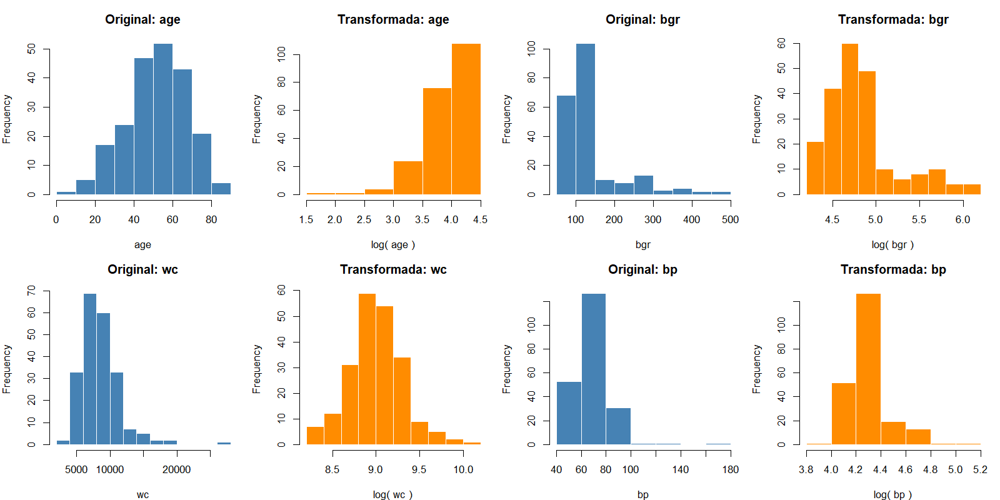

```{r setup}
#| include: false
library(bnlearn)
library(knitr)

# Resultados precalculados por los scripts 01-05
tabla_dags     <- readRDS("../data/processed/comparacion_bic_aic.rds")
resultados_q   <- readRDS("../data/processed/resultados_queries.rds")
tabla_mixto    <- readRDS("../data/processed/scores_mixto.rds")
tabla_np       <- readRDS("../data/processed/scores_noparametrico.rds")
```

## Abstract

<!-- TODO: 150-250 palabras. Objetivo, dataset, metodo (GBN), 3 estructuras
comparadas, hallazgo principal (DAG 1 mejor BIC/AIC), sin citar tablas. -->

## Introducción

La enfermedad renal crónica (ERC) es el deterioro progresivo y a largo plazo de la función renal: los riñones pierden gradualmente su capacidad de filtrar desechos y regular el equilibrio de líquidos y electrolitos del cuerpo. Es un problema de salud pública de gran magnitud: la prevalencia global se estima entre 8% y 16% de la población, y se calcula que uno de cada diez adultos en el mundo tiene algún grado de ERC. Un dato preocupante es que la enfermedad avanza de forma silenciosa, ya que nueve de cada diez adultos con ERC no saben que la padecen, lo que hace crítica la detección temprana.

Las dos causas principales son ampliamente reconocidas: la diabetes mellitus explica alrededor del 48.5% de los casos, y la hipertensión arterial cerca del 19%. Fisiológicamente, la hipertensión daña los vasos sanguíneos que irrigan los riñones y compromete su capacidad de filtrado, mientras que la diabetes provoca que el exceso de glucosa en sangre dañe progresivamente los filtros renales. Esta relación causal —edad, presión arterial y glucosa como antecedentes que derivan en daño renal medible por biomarcadores como la creatinina sérica— es precisamente la estructura que buscamos capturar con un modelo probabilístico.

El diagnóstico de ERC no depende de un solo valor de laboratorio, sino de la interacción entre múltiples biomarcadores (creatinina, urea, hemoglobina, potasio, sodio, entre otros) que están relacionados entre sí de manera causal y no siempre lineal. Un enfoque de caja negra pierde información valiosa sobre cómo estas variables se influyen unas a otras.

Una red bayesiana gaussiana (GBN) resuelve esto de dos formas complementarias: primero, modela explícitamente la incertidumbre, ya que en vez de dar una predicción puntual entrega distribuciones de probabilidad completas, lo que permite responder preguntas del tipo "¿qué tan probable es que la creatinina esté elevada dado que el paciente tiene cierta edad y presión arterial?", algo especialmente útil para apoyar decisiones clínicas donde rara vez hay certeza absoluta; y segundo, representa relaciones causales interpretables, la estructura de grafo dirigido (DAG) permite trazar visualmente cómo el envejecimiento y los factores de riesgo (presión arterial, glucosa) impactan la función renal, y cómo esta a su vez repercute en marcadores hematológicos secundarios como la anemia.

Esto conecta directamente con el reconocimiento de patrones: la red no solo predice, sino que expone la arquitectura de dependencias entre variables, permitiendo un diagnóstico temprano basado en evidencia observable (biomarcadores) en lugar de esperar síntomas avanzados.

El objetivo de este trabajo es implementar un modelo probabilístico —una red bayesiana gaussiana— que ayude a comprender cómo diferentes biomarcadores influyen en el diagnóstico de la enfermedad renal crónica, y utilizar dicho modelo para responder consultas probabilísticas de relevancia clínica.

El resto del artículo se organiza de la siguiente manera. La sección de Métodos describe el conjunto de datos y su preprocesamiento, el proceso de entrevistas mediante el cual se construyeron las tres estructuras candidatas, el ajuste y los criterios de evaluación de las redes, así como las dos extensiones exploradas: la incorporación de variables categóricas mediante una red condicional-gaussiana y la evaluación del supuesto de normalidad a través de una transformación logarítmica. La sección de Resultados presenta los valores de BIC y AIC obtenidos para cada estructura, las respuestas a las consultas planteadas por las especialistas y las métricas de ajuste de ambas extensiones. La sección de Discusión interpreta estos hallazgos a la luz de la literatura clínica y estadística, incluyendo la justificación formal de las consultas que no resultaron resolubles con la mejor estructura. Finalmente, se presentan las conclusiones y las limitaciones del estudio.

## Métodos

### Datos

El conjunto de datos utilizado corresponde al *Chronic Kidney Disease Dataset*, que contiene registros clínicos de 400 pacientes con y sin diagnóstico de enfermedad renal crónica. Cada registro incluye variables demográficas, resultados de análisis de sangre y orina, y comorbilidades reportadas.

Dado que una red bayesiana gaussiana asume que cada nodo sigue una distribución normal condicionada a sus padres, el modelo principal se restringió a las once variables continuas del conjunto: edad (`age`), presión arterial (`bp`), glucosa en sangre aleatoria (`bgr`), urea en sangre (`bu`), creatinina sérica (`sc`), sodio (`sod`), potasio (`pot`), hemoglobina (`hemo`), volumen de células empacadas (`pcv`), conteo de glóbulos blancos (`wc`) y conteo de glóbulos rojos (`rc`).

Se excluyeron del modelo principal las variables categóricas del conjunto original, así como tres variables que, pese a estar codificadas numéricamente, corresponden a escalas semicuantitativas y no a mediciones continuas: la densidad urinaria (`sg`), que toma únicamente cinco valores discretos, y la albúmina (`al`) y el azúcar en orina (`su`), reportadas como grados de tira reactiva en una escala ordinal de 0 a 5. Modelar estas variables como nodos gaussianos habría violado el supuesto distribucional de la GBN. Las variables de diabetes (`dm`) e hipertensión (`htn`) se reservaron para la extensión con variables categóricas descrita más adelante.

<!-- TODO: confirmar la procedencia exacta del dataset (¿UCI? ¿otra fuente?)
antes de citarlo en Referencias. No inventar la fuente. -->

### Preprocesamiento

El archivo original presentaba contaminación de formato que impedía la lectura correcta de varias columnas: caracteres de tabulación y espacios en blanco antepuestos a los valores, así como el carácter `?` empleado como marcador de dato faltante. Esta contaminación afectaba particularmente a `pcv`, `wc` y `rc`, que eran interpretadas como texto en lugar de como variables numéricas. El preprocesamiento normalizó estos campos y unificó los marcadores de ausencia bajo un valor `NA` consistente.

Adicionalmente se identificaron tres registros con valores fisiológicamente imposibles: un valor de sodio de 4.5 mEq/L y dos valores de potasio de 39 y 47 mEq/L. Considerando que los rangos de referencia son de 135 a 145 mEq/L para el sodio y de 3.5 a 5.5 mEq/L para el potasio, y que las concentraciones registradas resultan incompatibles con la vida, se interpretaron como errores de captura y se marcaron como datos faltantes. Esta decisión constituye una intervención deliberada sobre los datos y se documenta explícitamente por transparencia metodológica.

El conjunto presenta una proporción considerable de valores faltantes, concentrada en las variables hematológicas: conteo de glóbulos rojos (32.8%), conteo de glóbulos blancos (26.5%), potasio (22.5%), sodio (22.0%) y volumen de células empacadas (17.8%). Las restantes presentan porcentajes menores, desde 13.0% en hemoglobina hasta 2.2% en edad.

Se optó por un análisis de casos completos, que conserva 214 de los 400 registros originales (53.5%). Esta decisión responde a que el ajuste de una red bayesiana gaussiana mediante `bn.fit` requiere observaciones completas, y a que la imputación introduciría dependencias artificiales entre variables que son precisamente el objeto de estudio del modelo: imputar el valor de un biomarcador a partir de los demás presupondría una estructura de relaciones que el análisis busca inferir. La misma submuestra se empleó para ajustar las tres estructuras, garantizando que los valores de BIC y AIC sean comparables entre modelos al estar calculados sobre el mismo tamaño muestral.

### Estructuras candidatas (DAGs)

Se realizaron entrevistas con tres personas del entorno médico familiar; la mamá de Grethel, la tía de Matías Hidalgo, ambas médicas, y una amiga de Daniel Rodríguez, estudiante próxima a egresar de la carrera de Medicina, a quienes se les explicó el concepto de una DAG y con quienes se construyó cada estructura de manera conjunta, discutiendo la justificación clínica de cada relación de dependencia propuesta sobre las mismas once variables: edad, presión arterial, glucosa en sangre (aleatoria), creatinina sérica, urea en sangre, sodio, potasio, hemoglobina, volumen de células empacadas y conteo de glóbulos blancos y rojos. Las tres estructuras comparten un núcleo causal común: la edad como origen, la presión arterial y la glucosa en sangre como factores de riesgo intermedios, y el eje hematológico hemoglobina → volumen de células empacadas → conteo de glóbulos rojos como consecuencia del daño renal. Sin embargo, difieren en aspectos clave: la primera entrevistada ubicó a la creatinina sérica como único punto de convergencia por el que pasan todas las demás variables; la segunda limitó la influencia de la edad únicamente a la presión arterial, argumentando que la glucosa depende más de estilo de vida y genética que del envejecimiento, y propuso que tanto la glucosa en sangre como el conteo de glóbulos blancos inciden directamente sobre la creatinina sérica sin variables intermedias; mientras que la tercera planteó la estructura más elaborada, sugiriendo que la hiperglucemia crónica afecta al conteo de glóbulos blancos sin mediación del riñón, que la hemoglobina depende de tres variables (urea en sangre, conteo de glóbulos blancos y sodio) en lugar de una sola, reflejando el carácter multifactorial de la anemia renal, y añadiendo una relación dirigida del potasio hacia el sodio no considerada por las otras dos especialistas.


### Ajuste y evaluación de las Redes Bayesianas Gaussianas

<!-- TODO: describir que se ajustó una GBN por cada DAG con bn.fit()
sobre la MISMA submuestra de 214 casos completos, para que BIC y AIC
sean comparables entre estructuras (mismo n). Explicar brevemente qué
penalizan BIC y AIC y por qué en bnlearn un valor mayor indica mejor
ajuste. -->

### Extensión con variables categóricas

<!-- TODO: describir el modelo mixto de 04_categoricas.R:
- Por qué las categóricas no entran en una GBN puramente gaussiana
- Redes condicional-gaussianas (CLG): las variables discretas solo
  pueden ser nodos raíz o padres de nodos continuos, nunca hijos
- Se extendió la mejor DAG con dm (diabetes) y htn (hipertensión),
  las dos causas principales de ERC, mediante cuatro arcos:
  dm → bgr, dm → sc, htn → bp, htn → sc
- Se ajustó con bn.fit() sobre 212 casos completos y se comparó
  BIC/AIC (bic-cg y aic-cg) contra la GBN gaussiana pura -->

### Modelos no paramétricos

<!-- TODO: describir el enfoque de 05_no_parametrico.R:
- Las GBN asumen normalidad condicional en cada nodo; se evaluó ese
  supuesto con la prueba de Shapiro-Wilk
- Como alternativa flexible se aplicó una transformación logarítmica
  a las variables que rechazaron normalidad, y se reajustó la misma DAG
- IMPORTANTE (explicar en el texto): las verosimilitudes de modelos
  ajustados sobre escalas distintas no son directamente comparables.
  Al transformar Y = log(X), la densidad cambia según el jacobiano:
  f_Y(y) = f_X(x)·|dx/dy|. Para comparar en la escala original se
  restó el término sum(log(x)) a la log-verosimilitud del modelo
  transformado. -->

### Consultas (queries)

<!-- TODO: listar las 6 queries en notación de probabilidad, indicando
qué especialista propuso cada una (2 por especialista):

Q1: P(sc > 1.5 | bp = 100, bgr = 150)
Q2: P(hemo < 10 | age = 65)
Q3: P(wc > 11000 | pcv < 30)
Q4: P(pot > 5.5 | sc = 2.2, bu = 45)
Q5: P(pcv < 33 | bu = 60, sod = 130, wc = 11000)
Q6: P(rc < 3.8 | hemo = 9.5)

Mencionar que se resolvieron por muestreo con likelihood weighting
(cpquery, método "lw", 10^6 muestras, semilla fija para reproducibilidad). -->

## Resultados

### Comparación de BIC y AIC entre estructuras

```{r bic-aic-table}
#| echo: false
tabla_dags_fmt <- tabla_dags
tabla_dags_fmt$DAG <- c(
  "DAG 1 (creatinina como convergencia única)",
  "DAG 2 (glucosa y leucocitos directos)",
  "DAG 3 (anemia multifactorial)"
)[match(tabla_dags$DAG,
        c("DAG 1 (Mamá de Grethel)",
          "DAG 2 (Tía de Matías)",
          "DAG 3 (Prima de Daniel)"))]

kable(tabla_dags_fmt,
      col.names = c("Estructura", "Arcos", "BIC", "AIC"),
      align = c("l", "c", "r", "r"),
      caption = "BIC y AIC de las tres GBN ajustadas sobre los mismos 214 casos completos.")
```

<!-- TODO: 2-3 frases descriptivas SIN interpretar: cuál obtuvo el
valor más alto de BIC y AIC, y cuál la diferencia entre estructuras. -->

### Resultados de las consultas

```{r queries-results}
#| echo: false
# Enunciados en notacion LaTeX para renderizado matematico
enunciados_latex <- c(
  "$P(sc > 1.5 \\mid bp = 100,\\ bgr = 150)$",
  "$P(hemo < 10 \\mid age = 65)$",
  "$P(wc > 11000 \\mid pcv < 30)$",
  "$P(pot > 5.5 \\mid sc = 2.2,\\ bu = 45)$",
  "$P(pcv < 33 \\mid bu = 60,\\ sod = 130,\\ wc = 11000)$",
  "$P(rc < 3.8 \\mid hemo = 9.5)$"
)

tabla_q <- data.frame(
  Consulta  = paste0("Q", 1:6),
  Expresion = enunciados_latex,
  Resultado = sapply(resultados_q, function(x)
                ifelse(is.na(x$resultado),
                       "—",
                       sprintf("%.4f", x$resultado))),
  Estado    = sapply(resultados_q, function(x)
                ifelse(x$respondible, "Resuelta", "No resoluble")),
  row.names = NULL
)

kable(tabla_q,
      col.names = c("Consulta", "Expresión", "Resultado", "Estado"),
      align = c("c", "l", "r", "c"),
      escape = FALSE,
      caption = "Resultados de las seis consultas sobre la mejor estructura (DAG 1).")
```

<!-- TODO: reportar sin interpretar: cuántas queries se respondieron,
cuáles no y por qué motivo estructural (la justificación formal por
d-separación va en la Discusión). -->

### Modelo mixto con variables categóricas

```{r mixto-table}
#| echo: false
tabla_mixto_fmt <- tabla_mixto
tabla_mixto_fmt$Modelo <- c(
  "GBN gaussiana (DAG 1)",
  "Red condicional-gaussiana (DAG 1 + $dm$ + $htn$)"
)

kable(tabla_mixto_fmt,
      col.names = c("Modelo", "Nodos", "Arcos", "BIC", "AIC"),
      align = c("l", "c", "c", "r", "r"),
      escape = FALSE,
      caption = "Comparación entre la GBN gaussiana pura y la red condicional-gaussiana con diabetes e hipertensión.")
```


<!-- TODO: reportar los valores de las dos consultas de ejemplo:
P(sc > 1.5 | dm = yes, htn = yes) = 0.7835
P(sc > 1.5 | dm = no,  htn = no)  = 0.4070 -->

### Modelos no paramétricos

```{r np-table}
#| echo: false
tabla_np_fmt <- tabla_np
tabla_np_fmt$Modelo <- c(
  "GBN gaussiana (escala original)",
  "GBN gaussiana (escala $\\log$, sin corregir)",
  "GBN gaussiana (escala $\\log$, con corrección jacobiana)"
)

kable(tabla_np_fmt,
      col.names = c("Modelo", "BIC", "AIC", "Comparable"),
      align = c("l", "r", "r", "c"),
      escape = FALSE,
      caption = "Comparación de ajuste antes y después de la transformación logarítmica. Sólo las filas marcadas como comparables están definidas sobre la misma escala.")
```



<!-- TODO: reportar sin interpretar:
- Todas las variables rechazaron normalidad en el test original
  (p < 0.05); age y rc con los p-valores más altos (0.0194 y 0.0351)
- Tras la transformación, wc dejó de rechazar normalidad (p = 0.0512)
  y pot mejoró (p = 0.0001); age, sod, hemo, pcv y rc empeoraron
- BIC original -8799.90 vs BIC transformado corregido -8418.39 -->

## Discusión

### Comparación de estructuras

<!-- TODO: interpretar por qué la DAG 1 obtuvo el mejor ajuste.
Puntos a desarrollar:
- La DAG 1 es la más parsimoniosa de las tres en relación a su ajuste
- La DAG 3, pese a tener más arcos (13), obtuvo el peor BIC: más
  complejidad no implicó mejor ajuste, el BIC la penaliza
- Discutir si la centralidad de la creatinina sérica en la DAG 1
  (como único punto de convergencia) es consistente con la literatura
  clínica sobre marcadores de función renal -->

### Interpretación de las consultas

<!-- TODO: interpretar clínicamente cada query respondida, con
referencias que respalden los valores obtenidos. -->

<!-- TODO: justificación formal de las queries no respondibles.
Argumento por d-separación:

Q3 — P(wc > 11000 | pcv < 30): en la DAG 1, wc es hijo de sc y pcv es
hijo de hemo, que a su vez es hijo de sc. No existe camino activo entre
wc y pcv al condicionar únicamente en pcv, por lo que la evidencia no
altera la distribución de wc.

Q5 — P(pcv < 33 | bu = 60, sod = 130, wc = 11000): bu, sod y wc son
nodos hermanos de hemo (todos hijos de sc), y pcv es hijo de hemo. Sin
condicionar en sc o hemo, la evidencia no fluye hacia pcv.

Nota metodológica importante a incluir: cpquery devuelve un valor
numérico aunque la evidencia sea d-separada del evento; en esos casos
el valor obtenido aproxima la probabilidad marginal del evento y no
una probabilidad condicional en sentido causal. Reportarlo como
resultado condicional sería incorrecto.

Nota sobre Q4: la evidencia en bu es estructuralmente redundante dado
sc, pues ambos son hijos de sc y quedan d-separados al condicionar en
su padre común. El valor obtenido refleja principalmente el efecto
de sc sobre pot. -->

### Variables categóricas

<!-- TODO: interpretar. Puntos:
- El modelo mixto NO mejoró BIC ni AIC frente a la GBN pura: la
  penalización por los parámetros adicionales superó la ganancia en
  verosimilitud
- Sin embargo, la inferencia sí resultó clínicamente informativa:
  la probabilidad de creatinina elevada casi se duplica entre un
  paciente con diabetes e hipertensión (0.78) y uno sin ninguna (0.41)
- Discutir la tensión entre ajuste estadístico y utilidad clínica:
  un modelo puede no mejorar el criterio de información y aun así
  aportar capacidad explicativa relevante -->

### Modelos no paramétricos

<!-- TODO: interpretar. Puntos:
- Una vez aplicada la corrección jacobiana, la transformación
  logarítmica sí mejoró el ajuste (-8418.39 vs -8799.90)
- Discutir la aparente paradoja: la mayoría de variables siguieron
  rechazando normalidad marginal tras transformar, y aun así el
  ajuste conjunto de la red mejoró. Posible explicación: lo que la
  GBN requiere es normalidad CONDICIONAL de cada nodo dados sus
  padres, no normalidad marginal
- Analizar el trade-off flexibilidad vs. interpretabilidad: los
  coeficientes en escala logarítmica se interpretan como elasticidades
  y no como cambios absolutos, lo que complica la lectura clínica -->

### Articulación de los hallazgos

<!-- TODO: los resultados del modelo mixto y de la transformación
apuntan en direcciones distintas: agregar información categórica no
mejoró el ajuste, mientras que cambiar la escala de representación sí.
Discutir qué implica esto sobre dónde estaba la limitación real del
modelo (no en la falta de variables, sino en la forma funcional). -->

### Limitaciones

<!-- TODO:
- Pérdida de casi la mitad de la muestra por el uso de casos completos
  (214 de 400); posible sesgo si los datos no son MCAR
- Tamaño de muestra reducido para 11 variables
- Las estructuras provienen de tres especialistas del entorno familiar,
  no de un panel clínico formal ni de consenso entre expertos
- El dataset no documenta su procedencia poblacional, lo que limita
  la generalización de los resultados -->

## Conclusiones

<!-- TODO: 3-5 conclusiones concretas ligadas al objetivo planteado en
la Introducción. Sin información nueva. -->

## Referencias

Diabetes.org (American Diabetes Association). (s.f.). Diabetes, presión arterial alta y enfermedad renal crónica (ERC). Recuperado el 5 de septiembre de 2026, de https://diabetes.org/es/sobre-la-diabetes/complicaciones/enfermedad-renal-cronica/diabetes-presion-arterial-alta-enfermedad-renal-cronica

National Kidney Foundation. (2024, 8 noviembre). La hipertensión arterial y la diabetes: dos enemigos silenciosos para tus riñones. Kidney.org. https://www.kidney.org/es/news-stories/la-hipertension-arterial-y-la-diabetes-dos-enemigos-silenciosos-para-tus-rinones

Organización Panamericana de la Salud. (2014, 11 marzo). Crece el número de enfermos renales entre los mayores de 60 años con diabetes e hipertensión. OPS/OMS. https://www.paho.org/es/noticias/11-3-2014-crece-numero-enfermos-renales-entre-mayores-60-anos-con-diabetes-e-hipertension

Serna-Soto, J. L., Ortega-Mendoza, R. A. de J., Rivera-Ramírez, O. A., & Pérez-Peláez, G. C. (2016). Prevalencia de enfermedad renal crónica en pacientes con diabetes mellitus e hipertensión arterial en el Hospital Escandón. Salud Pública de México, 58(3), 338–339. https://doi.org/10.21149/spm.v58i3.7918

Vertigo Político. (2022). Los principales responsables de la enfermedad renal crónica son la diabetes y la hipertensión arterial. https://www.vertigopolitico.com/bienestar/notas/los-principales-responsables-la-enfermedad-renal-cronica-son-la-diabetes-y

<!-- TODO: agregar referencias metodológicas (bnlearn, Koller & Friedman
o similar sobre redes bayesianas, y fuentes clínicas para respaldar la
interpretación de las queries en la Discusión) -->

- [Repositorio del Proyecto](https://github.com/RafaelHeredia12/ARTICULO-2)
